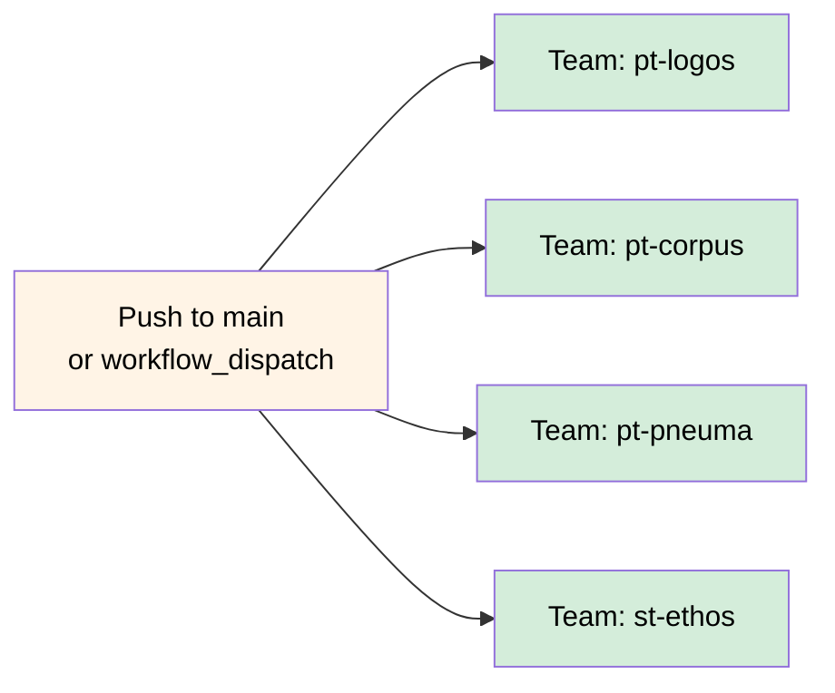

# Logos

[](https://github.com/osinfra-io/pt-logos/actions/workflows/dependabot.yml)

## 📄 Repository Description

This repository contains the Infrastructure as Code (IaC) that establishes the Logos layer — the platform’s primordial principle of order from which all other structure emerges. Using OpenTofu, it brings coherence across multiple cloud providers, setting the first boundaries that transform an undifferentiated technical landscape into a domain where disciplined creation is possible.

As the grounding stratum of the platform hierarchy, Logos encodes the organizational logic itself: the clear lines of access, the governance boundaries that restrain chaos, and the stable standards that enable higher-level systems to flourish. Through the lens of Team Topologies, this layer defines the hierarchy of responsibility and relationship, ensuring that each team inhabits a space conducive to productive action.

Logos is where the platform’s moral architecture begins — where order is spoken into being so that all subsequent layers may stand upon it.

## 🏭 Platform Information

- Documentation: [docs.osinfra.io](https://docs.osinfra.io/product-guides/google-cloud-platform/logos)
- Service Interfaces: [github.com](https://github.com/osinfra-io/pt-logos/issues/new/choose)

##  Development

Our focus is on the core fundamental practice of platform engineering, Infrastructure as Code.

>Open Source Infrastructure (as Code) is a development model for infrastructure that focuses on open collaboration and applying relative lessons learned from software development practices that organizations can use internally at scale. - [Open Source Infrastructure (as Code)](https://www.osinfra.io)

To avoid slowing down stream-aligned teams, we want to open up the possibility for contributions. The Open Source Infrastructure (as Code) model allows team members external to the platform team to contribute with only a slight increase in cognitive load. This section is for developers who want to contribute to this repository, describing the tools used, the skills, and the knowledge required, along with OpenTofu documentation.

See the [documentation](https://docs.osinfra.io/fundamentals/development-setup) for setting up a development environment.

### 🛠️ Tools

- [pre-commit](https://github.com/pre-commit/pre-commit)
- [osinfra-pre-commit-hooks](https://github.com/osinfra-io/pre-commit-hooks)

### 📋 Skills and Knowledge

Links to documentation and other resources required to develop and iterate in this repository successfully.

- [datadog teams](https://docs.datadoghq.com/account_management/teams/)
- [github repositories](https://docs.github.com/en/repositories)
- [github teams](https://docs.github.com/en/organizations/organizing-members-into-teams/about-teams)
- [google cloud platform groups](https://cloud.google.com/identity/docs/groups)
- [google cloud platform iam](https://cloud.google.com/iam/docs/overview)
- [google cloud platform resource landing-zone](https://cloud.google.com/resource-manager/docs/cloud-platform-resource-landing-zone)
- [team topologies](https://teamtopologies.com/)

## Architecture

The module creates a three-level Google Cloud Platform folder hierarchy following Team Topologies principles, using pre-created team type folders:

```text
Platform Teams/ (pre-created)
├── Corpus/
│   ├── Sandbox/
│   ├── Non-Production/
│   └── Production/
├── Logos/
│   ├── Sandbox/
│   ├── Non-Production/
│   └── Production/
└── Pneuma/
    ├── Sandbox/
    ├── Non-Production/
    └── Production/

Stream-aligned Teams/ (pre-created)
└── Ethos/
    ├── Sandbox/
    ├── Non-Production/
    └── Production/
```

**Note**: Team type folders (Platform Teams, Stream-aligned Teams, etc.) must be pre-created and their IDs provided via the `google_team_type_folder_ids` variable.

Additionally, it creates:

- **Google Cloud Identity Groups** with 3 standard roles per team (admin, writer, reader) applied at team folder level
- **GitHub Teams** with hierarchical structure (parent team with child teams for GitHub Actions approvers and repository administrators)
- **GitHub Repositories** with branch protection rules, webhook configurations, environment protection, and team-based access control
- **GitHub Users** with organization membership management and admin protection
- **Datadog Teams** for monitoring and observability with admin/member roles, one per top-level team
- **Datadog Users** with role-based access and admin protection
- **Datadog API Keys and Service Accounts** with application keys per team for CI/CD integration
- **GitHub Organization Settings** and Actions permissions (managed only in `pt-logos-main-production` workspace)
- **GitHub Repository Files** with `release.yml` and `SECURITY.md` automatically injected into every managed repository
- **Billing Budgets** per team folder with configurable monthly budget thresholds

## GitHub Actions Workflow

This repository uses a single production workflow that deploys directly on push to main (excluding `.md` files) and supports manual dispatch:



All four team jobs run in parallel using a matrix strategy (`fail-fast: false`).

## Interface

### Required Variables

#### `google_team_type_folder_ids`

A map of team types to their pre-created Google Cloud folder IDs. These folders must be created before running this configuration.

```hcl
google_team_type_folder_ids = {
  "platform-team"              = "123456789012"  # Platform Teams folder ID
  "stream-aligned-team"        = "123456789013"  # Stream-aligned Teams folder ID
  "complicated-subsystem-team" = "123456789014"  # Complicated-subsystem Teams folder ID
  "enabling-team"              = "123456789015"  # Enabling Teams folder ID
}
```

#### `team`

A map of teams with their team type and membership configuration for hardcoded
structures.

**Team Configuration Reference:**

- **Complete schema reference**: [`teams/example.tfvars`](teams/example.tfvars)
  documents ALL possible configuration options with detailed descriptions,
  examples, and field requirements
- **Real-world example**: [`teams/pt-pneuma.tfvars`](teams/pt-pneuma.tfvars)
  shows production team configuration with actual usage patterns

The example.tfvars file is the authoritative reference for:

- All available fields (required and optional)
- Field types and validation rules
- Default values and behaviors
- Usage examples for each configuration option
- Team Topologies naming conventions
- GKE cluster and networking configurations
- GitHub repository and environment setups

### Optional Variables

- **`google_billing_account`** - The GCP billing account ID used for team folder budgets (default: `"01C550-A2C86B-B8F16B"`)
- **`google_customer_id`** - Google Workspace customer ID for identity group management (default: `"C01hd34v8"`)
- **`google_monthly_budget_amount`** - Monthly budget threshold in USD per environment folder (default: `100`)
- **`google_primary_domain`** - Primary Google Workspace domain for identity group email generation (default: `"osinfra.io"`)

### Required Credentials (via GitHub Actions secrets)

These sensitive variables have no defaults and are passed as secrets in the GitHub Actions workflow:

- **`datadog_api_key`** - Datadog API key for monitoring integration
- **`datadog_app_key`** - Datadog APP key for monitoring integration
- **`github_token`** - GitHub token for provider authentication
- **`github_datadog_webhook_api_key`** - Datadog API key for GitHub webhook integration
- **`github_discord_webhook_api_key`** - Discord API key for GitHub webhook integration

### State Configuration Variables

These variables are required for backend configuration and are provided by GitHub Actions workflows:

- **`state_bucket`** - The name of the GCS bucket to store state files
- **`state_kms_encryption_key`** - The KMS encryption key for state and plan files
- **`state_prefix`** - The prefix for state files in the GCS bucket

## Team Structure

### Team Types (Team Topologies)

Each team must specify one of four team types:

- **`platform-team`** - Provides internal services to accelerate stream-aligned teams
- **`stream-aligned-team`** - Aligned to business capabilities/customer value streams
- **`complicated-subsystem-team`** - Focus on specific technical domains requiring deep expertise
- **`enabling-team`** - Help stream-aligned teams overcome obstacles and develop capabilities

### Environments

Each team automatically gets three hardcoded environment folders:

- **Hardcoded environments**: `Sandbox`, `Non-Production`, `Production`

### Google Identity Groups

Each team has exactly 3 Google Cloud identity groups using basic IAM roles applied at the team folder level:

- **Hardcoded basic IAM roles**: reader, writer, admin
  - reader: Permissions for read-only actions that don't affect state, such
    as viewing (but not modifying) existing resources or data.
  - writer: All of the permissions in the Reader role, plus permissions for
    actions that modify state, such as changing existing resources.
  - admin: All of the permissions in the Writer role, plus permissions for
    actions like the following: Completing sensitive tasks, like managing tag
    bindings for Compute Engine resources; Managing roles and permissions for
    a project and all resources within the project; Setting up billing for a
    project.

Users can be assigned to one of three roles within each group:

- **`managers`**: Users who can manage the group
- **`members`**: Regular members of the group
- **`owners`**: Users who own the group
- **Hardcoded roles**: admin, writer, reader (automatically assigned)

**Auto-generated fields:**

- **`description`**: Uses official Google Cloud role descriptions (e.g., "All
  of the permissions in the Writer role, plus permissions for actions like...")
- **`display_name`**: `"{Team Type}: {Team Name} {Role}"` (e.g., "Platform
  Team: Logos Administrators")

**Access Scope**: Groups have access to the entire team folder and all child
environment folders.

### Optional Team Configurations

Teams can optionally configure additional features beyond the required fields:

**Google Kubernetes Engine Clusters** (`google_kubernetes_engine_clusters`):

- Organized by region with embedded subnet configurations
- pt-corpus automatically creates Kubernetes project, VPC subnets, and DNS
  zones
- pt-pneuma deploys clusters with all configurations
- Supports multi-cluster service mesh with one fleet host cluster

**Artifact Registry Groups** (`google_artifact_registry_groups_memberships`):

- Two groups per team: readers (pull images) and writers (push images)
- Automatically integrates with pt-pneuma and pt-corpus service accounts

**DNS Subdomain Override** (`dns_subdomain`):

- Defaults to team key with prefix removed (e.g., pt-pneuma → pneuma)
- Override when custom subdomain needed

**pt-corpus Specific Groups** (only for pt-corpus team):

- `google_browser_groups_memberships`: Environment-specific console access for
  resource discovery
- `google_project_creator_groups_memberships`: Allows creating projects in
  team folders
- `google_xpn_admin_groups_memberships`: Allows attaching service projects to
  shared VPC

**Additional Projects** (`projects`):

- Define additional GCP projects beyond the standard Kubernetes project
- Specify API services to enable per project
- Note: Field is defined but not currently consumed by downstream repos

For complete documentation of all optional fields, see
[`teams/example.tfvars`](teams/example.tfvars).

### GitHub Team Structure

Each team has a hierarchical GitHub team structure with parent and child teams:

**Parent Team Configuration (`github_parent_team_memberships`):**

- **`maintainers`**: Users with full administrative access to the parent team
- **`members`**: Users with member access to the parent team

**Child Team Configuration (`github_child_teams_memberships`):**

Child teams are hardcoded with standardized names. Only membership is configurable:

- **`sandbox-approvers`**: Members who can approve sandbox environment changes
- **`non-production-approvers`**: Members who can approve Non-Production environment changes
- **`production-approvers`**: Members who can approve production environment changes
- **`repository-administrators`**: Repository administrators with full access

Each team has `maintainers` and `members` lists that you populate with GitHub usernames.

**Membership Logic:**

- **Parent Team**: Gets configured maintainers/members PLUS child team maintainers (auto-inherited as members)
- **Child Teams**: Hardcoded structure with configurable membership lists
- **Deduplication**: Users configured directly on parent team take precedence over auto-inherited membership

### Datadog Organization Settings

**Organization-Level Configuration (managed only in `pt-logos-main-production` workspace):**

- **Log Indexes**: Organization-wide log routing and retention policies
  - Hardcoded in `locals.tofu` with index configurations grouped by retention tier (high-retention, low-retention, medium-retention, main)
  - Each index defines daily limits, retention periods, filter queries, and optional exclusion filters
  - Indexes are ordered automatically for proper log routing precedence

- **Organization Settings**:
  - SAML configuration (autocreate users, domains, IdP-initiated login, strict mode)
  - Widget sharing policies
  - Organization name and branding

**Note**: These settings are hardcoded organizational configuration, not team-specific parameters. Modifications require updating `locals.tofu` directly.

### User Management & Admin Protection

**Organization Owners/Admins:**

- **GitHub**: Hardcoded organization owners in `locals.tofu` get admin role and lifecycle protection
- **Datadog**: Hardcoded organization admins in `locals.tofu` get admin role and lifecycle protection
- **Conditional Creation**: Admin/owner resources are only created when running in the `pt-logos-main-production` workspace to prevent conflicts across team deployments
- **Protection**: Admin users cannot be destroyed via `tofu destroy` due to `prevent_destroy = true` lifecycle rules
- **Role Protection**: Admin roles cannot be accidentally changed via `ignore_changes` lifecycle rules

**Regular Users:**

- **GitHub**: Team members get standard member role and can be managed normally
- **Datadog**: Team members get read-only role by default, but can be assigned standard role via hardcoded list in `locals.tofu`
- **Management**: Can be added/removed through normal Infrastructure as Code workflows

**Admin Removal Process:**

1. Remove user from hardcoded admin list in `locals.tofu`
2. Run `tofu plan` and `tofu apply`
3. Manually remove user via platform UI (GitHub/Datadog)

**Security**: This two-step process prevents accidental loss of organization access during infrastructure changes.

## Cross-Workspace Architecture

This infrastructure uses a sophisticated cross-workspace architecture that enables clean separation of concerns while allowing shared resources:

### Workspace Separation

- **`pt-logos-main-production`**: Central workspace that manages organization-level admin resources (GitHub owners, Datadog admin users)
- **Team Workspaces** (e.g., `pt-corpus-main-production`, `pt-pneuma-main-production`): Individual team workspaces that manage team-specific resources

### Admin User Management

**Admin User Resources**:

- Created only in the `pt-logos-main-production` workspace to prevent resource conflicts
- Protected by lifecycle rules (`prevent_destroy = true`) to maintain platform access
- Include GitHub organization owners and Datadog organization admin users

**Team Membership for Admin Users**:

- Admin users can be members of teams across all workspaces using data source lookups
- Non-logos workspaces use `datadog_user` data sources to reference admin users created in the logos workspace
- This allows admin users to be team members without creating duplicate user resources

**Example**:

```hcl
# In pt-logos-main-production workspace
resource "datadog_user" "admins" {
  # Creates admin user resources
}

# In team workspaces (e.g., pt-corpus-main-production)
data "datadog_user" "existing_admins" {
  # References admin users created in logos workspace
}

resource "datadog_team_membership" "this" {
  # Uses data source reference for admin users
  user_id = each.value.user_id_lookup == "admin" ?
    data.datadog_user.existing_admins[...].id :
    datadog_user.this[...].id
}
```

### Benefits

- ✅ **No Resource Conflicts**: Admin users created once in logos workspace, referenced elsewhere via data sources
- ✅ **Clean Separation**: Team workspaces focus on team-specific resources
- ✅ **Scalable Architecture**: Works for any number of teams and admin users
- ✅ **Maintains Security**: Admin user lifecycle controlled centrally while allowing team participation

## Outputs for Downstream Consumption

This foundational infrastructure provides outputs designed for consumption by downstream repositories that may need foundational infrastructure information:

### `teams`

Complete team infrastructure information including:

- Team metadata (display name, team type)
- Folder hierarchy (team type folder, team folder ID, environment folder IDs)
- Identity groups with email addresses, display names, descriptions, and roles

Each team entry also includes: `billing_users_group` (org-level billing group email), `github_repositories` (full_name, html_url, name per repo), and `google_kubernetes_engine_clusters` (cluster configurations with embedded subnet definitions).

These outputs provide downstream repositories with foundational infrastructure information including folder placement and access controls for any additional resource deployments.

## Validation Rules

### Team Types

- Must be exactly: `"platform-team"`, `"stream-aligned-team"`, `"complicated-subsystem-team"`, `"enabling-team"`

### Display Names

- Must be Title Case with first letter of each word capitalized
- Only letters, numbers, and spaces allowed
- The word "and" is allowed in lowercase (e.g., "Trust and Safety")

## Naming Conventions

- **Team Type folders**: Team Topologies categories with "Teams" suffix (e.g., "Platform Teams", "Stream-aligned Teams")
- **Team folders**: Use team display names from configuration (e.g., "Logos", "Ethos")
- **Environment folders**: Hardcoded environment names (e.g., "Sandbox", "Non-Production", "Production")
- **Team prefixes**: `pt-` (platform), `st-` (stream-aligned), `ct-` (complicated-subsystem), `et-` (enabling)
- **Google Identity groups**: `{team_key}-{plural_role}@{domain}` (where `team_key` already includes the prefix, e.g. `pt-logos-administrators@osinfra.io`, `pt-logos-readers@osinfra.io`)
- **GitHub teams**: Parent `{team_prefix}-{team_key}`, Children `{parent}-{function}`
- **Datadog teams**: Handle `{team_prefix}-{team_key}`, Name `"{Team Type}: {Team Name}"`, Description `"{Team Name} is a {Team Type} {Team Topologies description}."`
