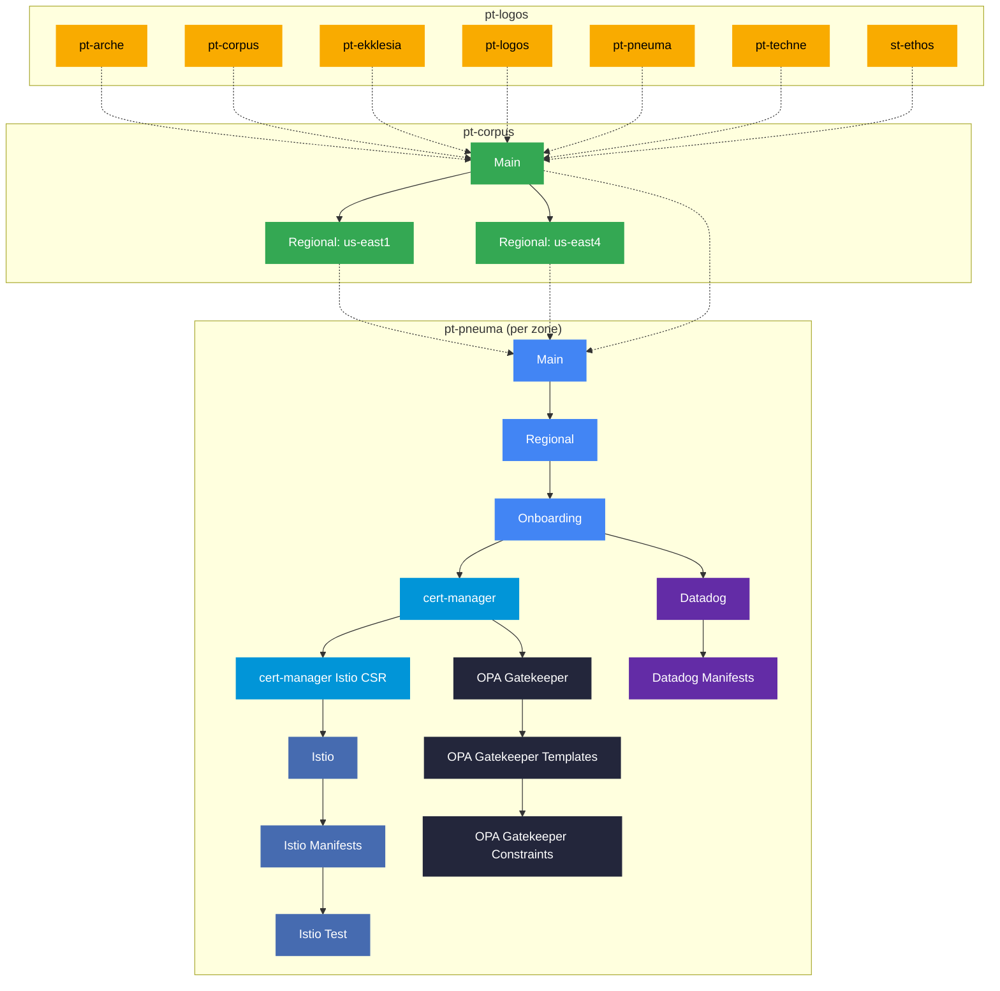

# Logos

  

## 📄 Repository Description

This repository contains the Infrastructure as Code (IaC) that establishes the Logos layer — the platform’s primordial principle of order from which all other structure emerges. Using OpenTofu, it brings coherence across multiple cloud providers, setting the first boundaries that transform an undifferentiated technical landscape into a domain where disciplined creation is possible.

As the grounding stratum of the platform hierarchy, Logos encodes the organizational logic itself: the clear lines of access, the governance boundaries that restrain chaos, and the stable standards that enable higher-level systems to flourish. Through the lens of Team Topologies, this layer defines the hierarchy of responsibility and relationship, ensuring that each team inhabits a space conducive to productive action.

Logos is where the platform’s moral architecture begins — where order is spoken into being so that all subsequent layers may stand upon it.

### 🛠️ Tools

- [pre-commit](https://github.com/pre-commit/pre-commit)
- [osinfra-pre-commit-hooks](https://github.com/osinfra-io/pt-techne-pre-commit-hooks)

### 📋 Skills and Knowledge

Links to documentation and other resources required to develop and iterate in this repository successfully.

- [datadog logs](https://docs.datadoghq.com/logs/)
- [datadog teams](https://docs.datadoghq.com/account_management/teams/)
- [github repositories](https://docs.github.com/en/repositories)
- [github teams](https://docs.github.com/en/organizations/organizing-members-into-teams/about-teams)
- [google billing budgets](https://cloud.google.com/billing/docs/how-to/budgets)
- [google cloud platform groups](https://cloud.google.com/identity/docs/groups)
- [google cloud platform iam](https://cloud.google.com/iam/docs/overview)
- [google cloud platform resource landing-zone](https://cloud.google.com/resource-manager/docs/cloud-platform-resource-landing-zone)
- [team topologies](https://teamtopologies.com/)

## 🔄 Platform Deployment Dependency Graph

The platform follows a strict three-layer deployment hierarchy: **Logos → Corpus → Pneuma**. Logos deploys all team workspaces as a parallel matrix directly to production on merge to `main`. Corpus and Pneuma each follow a Sandbox → Non-Production → Production environment progression. Solid arrows are within-workflow job dependencies. Dashed arrows are cross-repo state dependencies consumed via `opentofu-core-helpers` — Corpus reads Logos team outputs, and Pneuma reads both Corpus main (projects, service accounts) and regional (networking, subnets) outputs. The Pneuma section shows the dependency chain for one zone — the same pattern repeats for each active zone in the environment.

